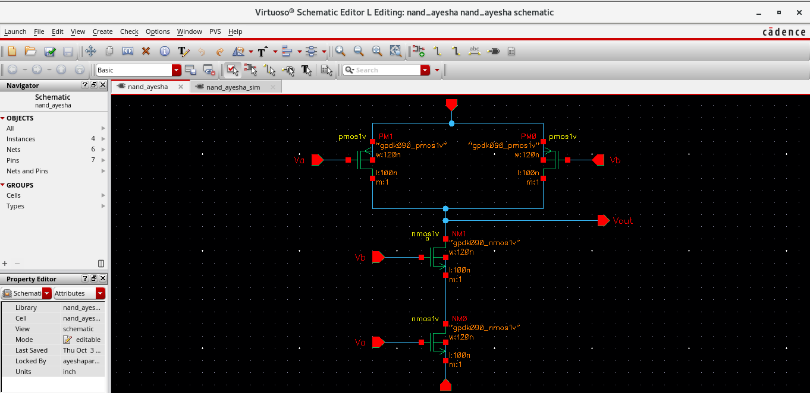
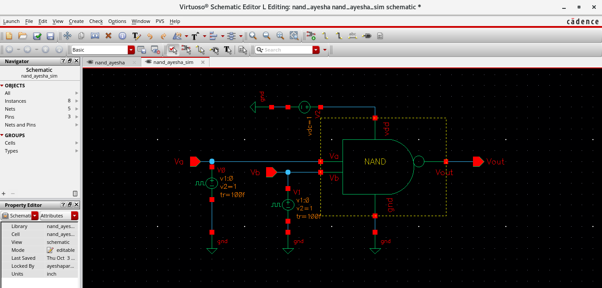
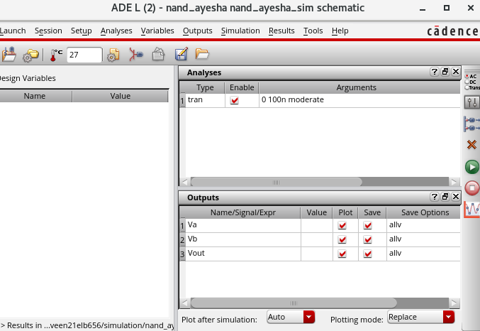
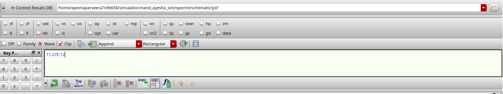

# NAND Gate Design: Schematic to GDSII using GPDK90 in Cadence

This repository contains the complete design flow for a NAND gate, from schematic creation to GDSII generation, using Cadence tools with the GPDK90 process library. A NAND gate is a fundamental digital circuit that produces a low output only when all inputs are high. This project includes schematic design, layout, design rule checks (DRC), layout versus schematic checks (LVS), and RC extraction.

## Project Overview

### NAND Gate: Definition and Truth Table
A NAND gate performs a NOT-AND operation on two inputs (A and B). The output is low only when both inputs are high.

**Truth Table:**
| Input A | Input B | Output (Y) |
|---------|---------|------------|
|    0    |    0    |     1      |
|    0    |    1    |     1      |
|    1    |    0    |     1      |
|    1    |    1    |     0      |

### Design Flow
This project follows a standard ASIC design flow for digital circuits:
1. **Schematic Creation**
2. **Symbol and Testbench Setup**
3. **Pre-Layout Simulation**
4. **Layout Creation (DRC and LVS checks)**
5. **Post-Layout Simulation**
6. **RC Extraction**
7. **GDSII Generation**

---

## Detailed Process and Results

### 1. Schematic Creation
The NAND gate schematic was created using GPDK90 in Cadence, forming the foundation for further simulation and layout design.

**Schematic Diagram:**

  

### 2. Symbol and Testbench Creation
A symbol view was generated for the NAND gate, and a testbench was set up to verify its functionality through transient and delay analysis.

  

### 3. Pre-Layout Simulation Results
Simulations were conducted to verify the functionality and timing of the NAND gate, by setting the adel as shown below.

  

  

Delay from Terminal 'VA' to 'VOUT':

  

### 4. Layout Creation and Verification
The layout was designed in Cadence Virtuoso using GPDK90. Design Rule Check (DRC) and Layout Versus Schematic (LVS) checks were performed to ensure compliance and accuracy.
#### DRC Result:

  

#### LVS Result:

  

### 5. Post-Layout Simulation Results
Post-layout simulations were performed to observe performance changes due to parasitic elements.

### 6. RC Extraction
RC extraction was completed to model parasitic capacitances and resistances, ensuring accurate post-layout simulations.

### 7. GDSII Generation
The final layout was exported in GDSII format for tape-out or further processing steps.

---

## Tools Used
- **Cadence Virtuoso** for Schematic, Layout, and GDSII generation
- **Spectre Simulator** for pre- and post-layout simulations
- **GPDK90**: A generic process design kit based on 90 nm technology

---

## Acknowledgements
- Chips to Startup (C2S) program, MeitY, Government of India
- Dr Mohd Wajid, Associcate Professor, AMU
